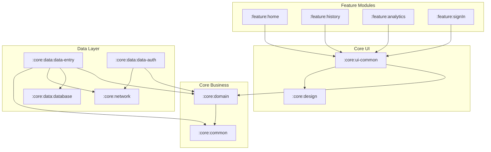

# TrackMate

An R&D Android project demonstrating modern mobile architecture patterns through a habit and task tracking application.

## Overview

TrackMate is a reference implementation showcasing Clean Architecture, offline-first data synchronization, and reactive UI patterns using Jetpack Compose. While functional as a productivity app, its primary purpose is to serve as an educational resource for modern Android development practices.

## Tech Stack

| Category | Technologies |
|----------|--------------|
| Language | Kotlin 2.2, Java 17 |
| UI | Jetpack Compose, Material Design 3 |
| Architecture | Clean Architecture, MVI |
| DI | Hilt / Dagger |
| Database | Room |
| Backend | Firebase (Auth, Firestore, Crashlytics) |
| Async | Kotlin Coroutines, Flow, WorkManager |
| Testing | JUnit, MockK, Turbine, Robolectric |
| Build | Gradle Kotlin DSL, KtLint |

## Architecture

TrackMate follows a modular Clean Architecture approach with clear separation between presentation, domain, and data layers.



### Key Modules

| Module | Purpose |
|--------|---------|
| `:app` | Application entry point, navigation, sync orchestration |
| `:core:domain` | Domain models (Entry, Task, Habit), repository interfaces |
| `:core:data:data-entry` | Entry repository implementation, sync logic |
| `:core:ui-common` | BaseViewModel, shared UI utilities |
| `:feature:home` | Main task/habit list screen |

## Quick Start

### Prerequisites

- Android Studio Ladybug (2024.2.1) or later
- JDK 17
- Android SDK 36

### Setup

1. **Clone the repository**
   ```bash
   git clone https://github.com/your-org/trackmate.git
   cd trackmate
   ```

2. **Firebase Configuration**

   Copy your `google-services.json` to the `app/` directory. For local development, you can use the Firebase emulator suite.

3. **Build the project**
   ```bash
   ./gradlew assembleDebug
   ```

4. **Run tests**
   ```bash
   ./gradlew test
   ```

### Firebase Emulator (Optional)

For local development without a Firebase project:

```bash
firebase emulators:start --only auth,firestore
```

## Project Structure

```
TrackMate/
├── app/                          # Application module
│   └── src/main/java/.../
│       ├── di/                   # Hilt modules
│       ├── sync/                 # EntrySyncManager
│       ├── reminder/             # Reminder strategies
│       └── navigation/           # Navigation setup
├── core/
│   ├── domain/                   # Domain layer
│   ├── data/
│   │   ├── data-entry/          # Entry repository
│   │   ├── data-auth/           # Auth repository
│   │   └── database/            # Room database
│   ├── network/                  # API layer
│   ├── common/                   # Shared utilities
│   ├── ui-common/               # BaseViewModel, UI utils
│   ├── design/                   # Design system
│   └── testing/                  # Test utilities
├── feature/
│   ├── home/                     # Home screen
│   ├── history/                  # History screen
│   ├── analytics/                # Analytics screen
│   └── signIn/                   # Sign-in flow
└── docs/                         # Documentation
```

## Documentation

- [Architecture Overview](ARCHITECTURE.md)
- [Contributing Guidelines](CONTRIBUTING.md)
- [Getting Started Guide](docs/guides/getting-started.md)

### Architecture Decision Records

- [ADR-001: Modular Clean Architecture](docs/decisions/001-modular-clean-architecture.md)
- [ADR-002: MVI Pattern](docs/decisions/002-mvi-pattern.md)
- [ADR-003: Offline-First Sync Strategy](docs/decisions/003-offline-first-sync-strategy.md)
- [ADR-004: Error Classification & Retry Policy](docs/decisions/004-error-classification-retry-policy.md)
- [ADR-005: Strategy Pattern for Reminders](docs/decisions/005-strategy-pattern-reminders.md)

### Pattern Documentation

- [BaseViewModel Pattern](docs/patterns/base-viewmodel-pattern.md)
- [Error Handling Pattern](docs/patterns/error-handling-pattern.md)

### Developer Guides

- [Getting Started](docs/guides/getting-started.md)
- [Adding a New Feature](docs/guides/adding-new-feature.md)
- [Testing Guide](docs/guides/testing-guide.md)

## Build Variants

| Variant | Description |
|---------|-------------|
| `debug` | Development build with debugging enabled |
| `release` | Optimized build with ProGuard minification |

## Version

Current version: **0.2.0**

See [CHANGELOG.md](CHANGELOG.md) for release history.

## License

This project is for educational and R&D purposes.
