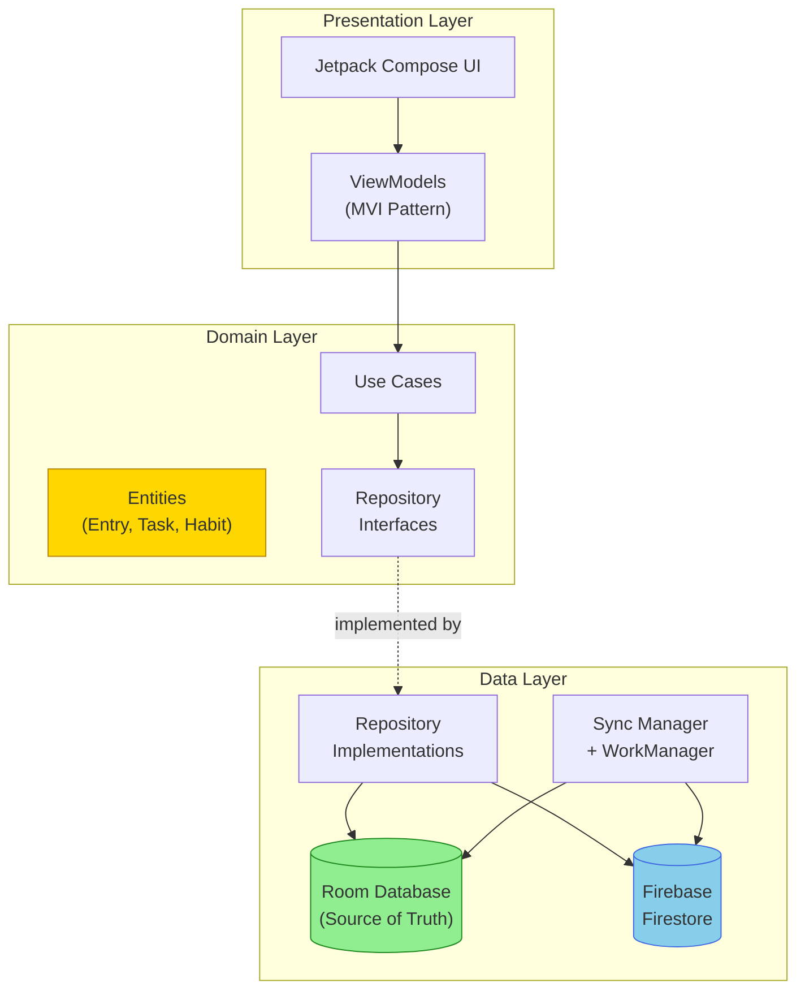
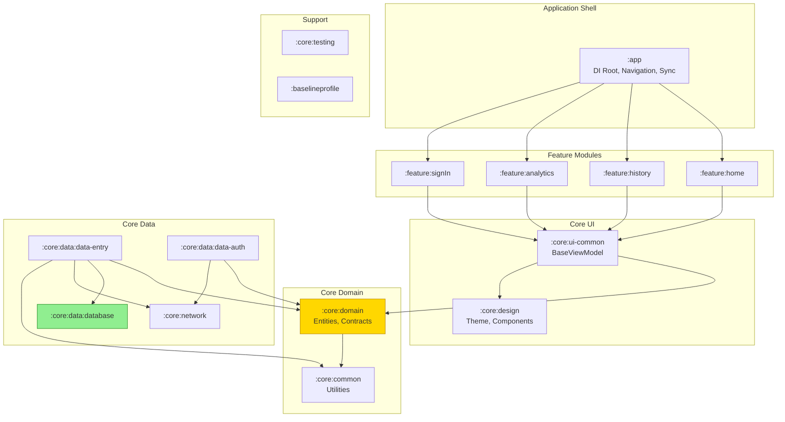
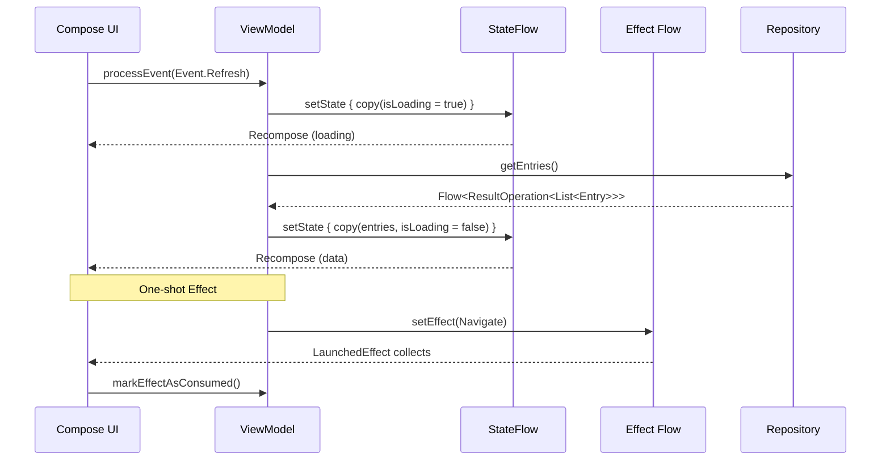
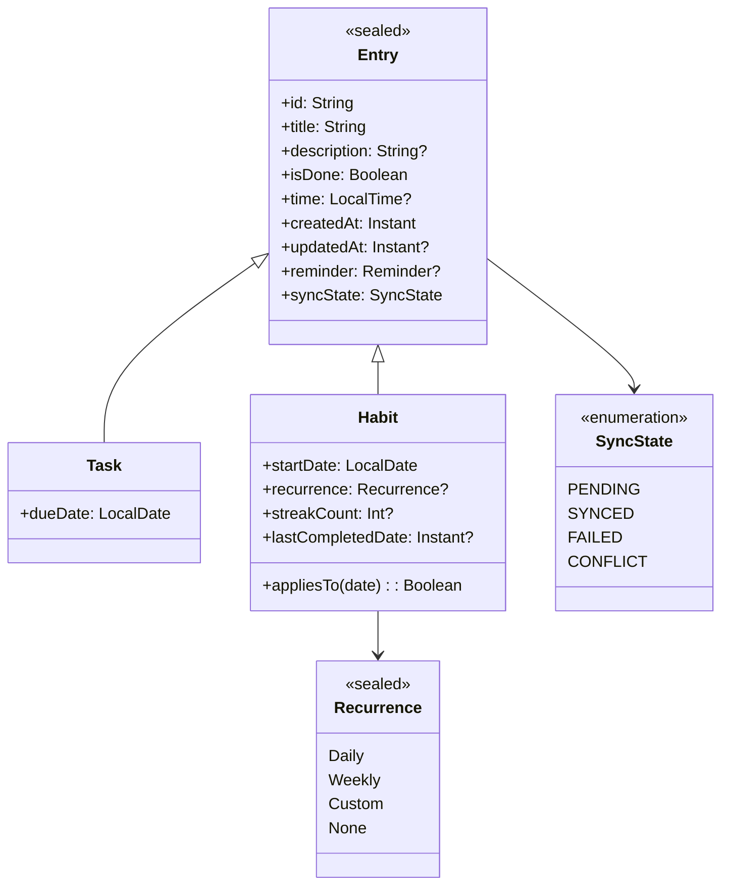
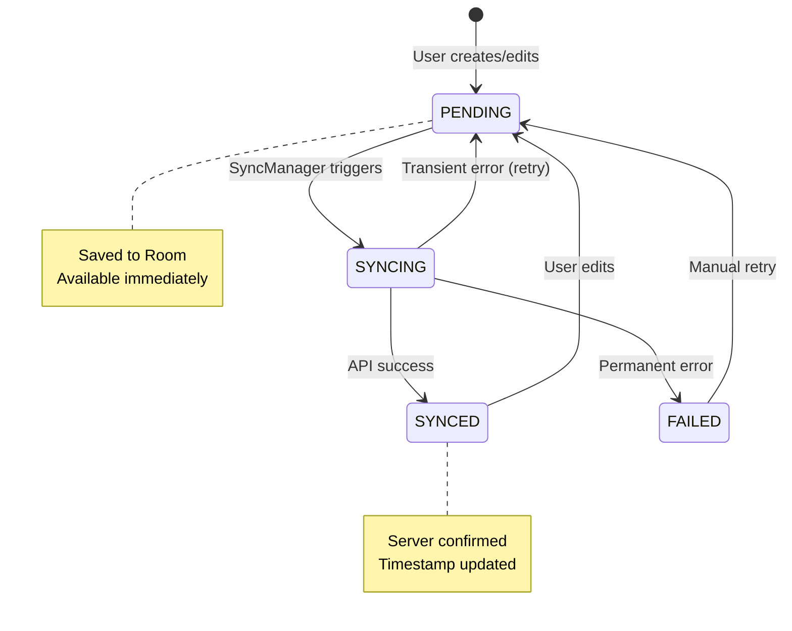
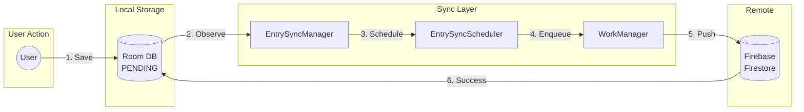
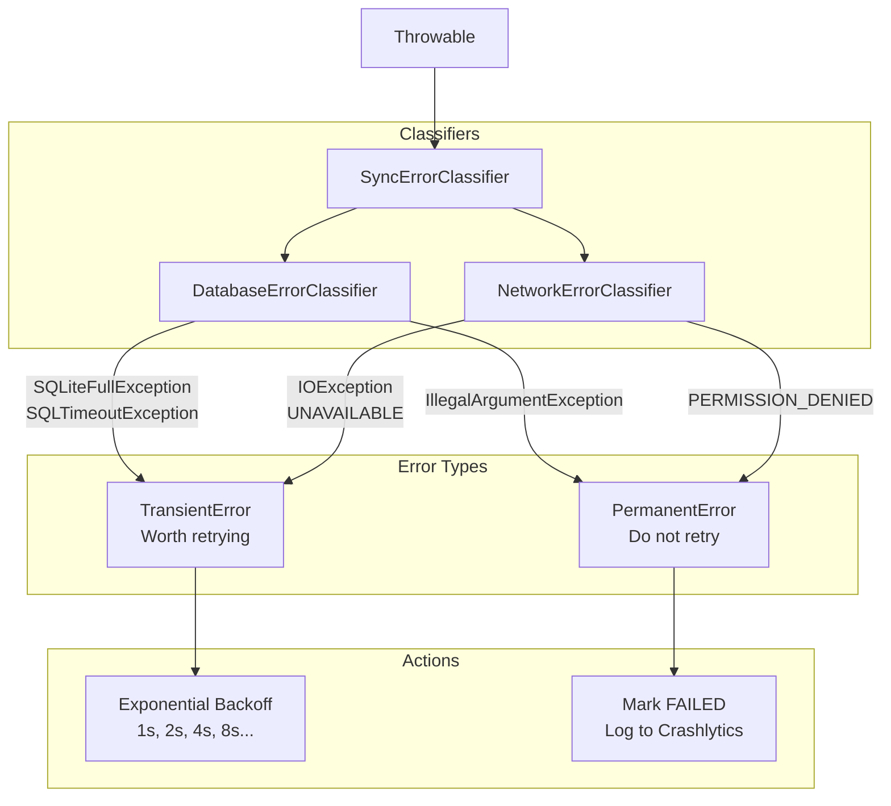
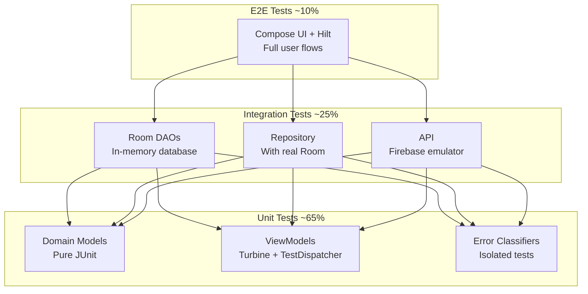
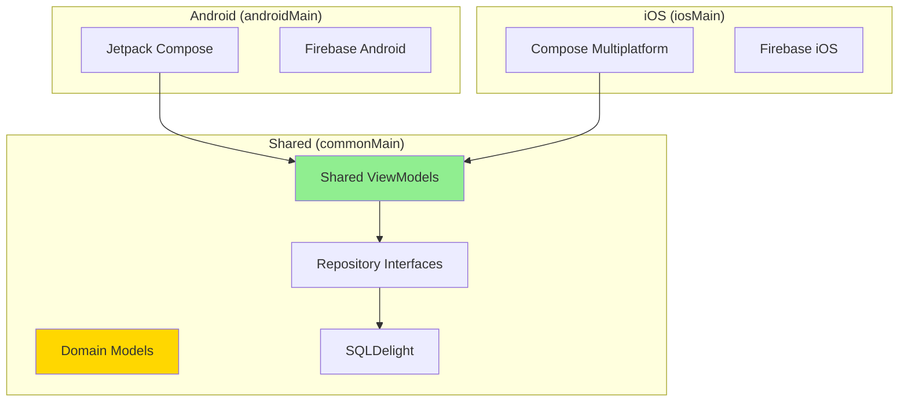

# TrackMate Architecture Reference

> **Living Document** | Version 1.0 | Last Updated: 2026-02-12

---

## Document Purpose

This document serves as the **architectural reference** for TrackMate, an R&D project demonstrating solutions for building robust, offline-capable, multi-device applications.

**Scope**: Documents current architectural state, design rationale, and evolution roadmap toward Kotlin Multiplatform (KMP).

---

## Table of Contents

1. [Project Vision & Goals](#1-project-vision--goals)
2. [Architecture at a Glance](#2-architecture-at-a-glance)
3. [Module Architecture](#3-module-architecture)
4. [Presentation Layer (MVI)](#4-presentation-layer-mvi)
5. [Domain Layer Design](#5-domain-layer-design)
6. [Offline-First Data Architecture](#6-offline-first-data-architecture)
7. [Error Handling & Resilience](#7-error-handling--resilience)
8. [Testing Strategy](#8-testing-strategy)
9. [Performance Considerations](#9-performance-considerations)
10. [KMP Migration Roadmap](#10-kmp-migration-roadmap)
11. [ADR Index](#11-adr-index)
12. [Appendices](#12-appendices)

---

## 1. Project Vision & Goals

### Business Context

TrackMate is a **habit and task tracking** application designed to help users build consistent routines. The app manages two entry types:

- **Tasks**: One-time activities with specific due dates
- **Habits**: Recurring activities with streak tracking and recurrence patterns

### Architectural Drivers

This R&D project addresses four key challenges that drive architectural decisions:

| Driver | Challenge | Architectural Response |
|--------|-----------|------------------------|
| **Offline-First** | App must work without network connectivity | Room as source of truth, background sync |
| **Multi-Device** | Support smartphone, watch, TV, car platforms | Kotlin Multiplatform migration path |
| **Performance** | Optimize for constrained devices (wearables) | Baseline profiles, concurrency limits |
| **Testability** | Enable comprehensive testing at all levels | Pure domain layer, injectable dispatchers |

### Design Principles

1. **Testability** - Every component can be tested in isolation
2. **Offline-First** - The app functions fully without network connectivity
3. **Modularity** - Clear boundaries enable parallel development and code sharing

### Target Scale

- Personal use (1-3 devices per user)
- Single-user data model with eventual consistency
- Last-Write-Wins conflict resolution

---

## 2. Architecture at a Glance

### System Overview



### Technology Stack

| Layer | Technology | Purpose |
|-------|------------|---------|
| **UI** | Jetpack Compose, Material Design 3 | Declarative UI framework |
| **State** | MVI via BaseViewModel | Unidirectional data flow |
| **Async** | Kotlin Coroutines, Flow | Reactive programming |
| **DI** | Hilt | Dependency injection |
| **Local DB** | Room | SQLite abstraction |
| **Remote** | Firebase Firestore | Cloud synchronization |
| **Background** | WorkManager | Persistent background tasks |
| **Build** | Gradle KTS, Version Catalog | Build configuration |

---

## 3. Module Architecture

TrackMate uses a **16-module** structure enforcing strict dependency rules.

### Module Dependency Graph



### Module Inventory

| Category | Module | Responsibility |
|----------|--------|----------------|
| **App** | `:app` | Application lifecycle, DI root, navigation, sync orchestration |
| **Feature** | `:feature:home` | Main entry list, add/edit functionality |
| | `:feature:history` | Historical entry view |
| | `:feature:analytics` | Analytics dashboard |
| | `:feature:signIn` | Authentication flow |
| **Core UI** | `:core:ui-common` | BaseViewModel, shared UI utilities |
| | `:core:design` | Material 3 theme, design system |
| **Core Domain** | `:core:domain` | Business entities, repository interfaces |
| | `:core:common` | Utilities, dispatchers, logging |
| **Core Data** | `:core:data:data-entry` | Entry repository implementation |
| | `:core:data:data-auth` | Auth repository implementation |
| | `:core:data:database` | Room database, DAOs, entities |
| | `:core:network` | Firebase clients |
| **Support** | `:core:testing` | Test utilities, fakes |
| | `:baselineprofile` | Startup profile generation |

### Dependency Rules

```
RULE: Dependencies flow downward only

:feature:* ──► :core:ui-common ──► :core:domain
                                        │
:core:data:* ─────────────────────────►─┘
     │
     └──► :core:database, :core:network, :core:common
```

> **Cross-Reference**: [ADR-001: Modular Clean Architecture](../decisions/001-modular-clean-architecture.md)

---

## 4. Presentation Layer (MVI)

The presentation layer implements **MVI (Model-View-Intent)** pattern through a shared `BaseViewModel`.

### MVI Contract

```kotlin
abstract class BaseViewModel<
    UiState : ViewState,
    Effect : ViewEffect,
    Event : ViewEvent
> : ViewModel()
```

| Component | Purpose | Type |
|-----------|---------|------|
| **UiState** | Single source of truth for UI | `StateFlow<UiState>` |
| **Event** | User intentions/actions | Sealed interface |
| **Effect** | One-shot side effects | Nullable flow |

### MVI Data Flow



### Key Methods

```kotlin
// Update state immutably
protected fun setState(reducer: UiState.() -> UiState)

// Process user interactions
abstract fun processEvent(event: Event)

// Emit one-shot effects
protected fun setEffect(effect: Effect)
protected fun markEffectAsConsumed()
```

> **Cross-Reference**: [ADR-002: MVI Pattern](../decisions/002-mvi-pattern.md), [BaseViewModel Pattern](../patterns/base-viewmodel-pattern.md)

---

## 5. Domain Layer Design

The domain layer contains **pure business logic** with zero Android dependencies, making it inherently KMP-compatible.

### Domain Model



### Repository Contracts

```kotlin
interface EntryRepository {
    // Streams
    val pendingEntries: Flow<List<Entry>>
    val deletedEntryIds: Flow<List<String>>

    // Queries
    fun getEntriesVisibleOn(date: LocalDate): Flow<ResultOperation<List<Entry>>>
    fun getTasks(): Flow<ResultOperation<List<Task>>>
    fun getHabits(): Flow<ResultOperation<List<Habit>>>

    // Commands
    suspend fun saveEntry(entry: Entry): ResultOperation<Unit>
    suspend fun deleteEntry(entryId: String): ResultOperation<Unit>
    suspend fun syncEntries(): ResultOperation<Unit>
}
```

### Domain Services

| Service | Responsibility |
|---------|----------------|
| `ErrorClassifier` | Classifies errors as transient or permanent |
| `ReminderStrategy` | Abstract strategy for reminder scheduling |
| `EntrySyncScheduler` | Interface for scheduling sync operations |

> **Cross-Reference**: [core/domain README](../../core/domain/README.md)

---

## 6. Offline-First Data Architecture

TrackMate implements a **local-first** architecture where Room serves as the single source of truth.

### Core Principle

> **All reads come from local database. Writes persist locally first, then sync asynchronously.**

### Sync State Lifecycle



### Write Flow Architecture



### Conflict Resolution

**Strategy**: Last-Write-Wins (LWW) based on `updatedAt` timestamp.

```kotlin
// EntrySyncResolver
fun shouldReplace(current: Entry, incoming: Entry): Boolean {
    return incoming.updatedAt > current.updatedAt
}
```

### Concurrency Control

```kotlin
// Semaphore limits concurrent DB operations
val dbSemaphore = Semaphore(BuildConfig.DB_SYNC_CONCURRENCY) // 4

// Per-entry mutex prevents race conditions
val entryLocks = ConcurrentHashMap<String, Mutex>()

// Usage
dbSemaphore.withPermit {
    entryLocks.computeIfAbsent(entryId) { Mutex() }
        .withLock { /* database operation */ }
}
```

> **Cross-Reference**: [ADR-003: Offline-First Sync Strategy](../decisions/003-offline-first-sync-strategy.md)

---

## 7. Error Handling & Resilience

### Error Classification Chain



### Error Types

```kotlin
sealed class ErrorType {
    data class TransientError(val cause: Throwable) : ErrorType()
    data class PermanentError(val cause: Throwable) : ErrorType()
}
```

### Result Wrapper

```kotlin
sealed class ResultOperation<T> {
    data class Success<T>(val data: T) : ResultOperation<T>()
    data class Error<T>(
        val throwable: Throwable,
        val isRetriable: Boolean
    ) : ResultOperation<T>()
}
```

### Retry Policy

```kotlin
class ExponentialBackoffPolicy(
    private val maxAttempts: Int = 5,
    private val baseDelayMs: Long = 1000
) : RetryPolicy {
    override suspend fun <T> execute(block: suspend () -> T): T {
        // Retries with delays: 1s, 2s, 4s, 8s, 16s
    }
}
```

> **Cross-Reference**: [ADR-004: Error Classification & Retry Policy](../decisions/004-error-classification-retry-policy.md), [Error Handling Pattern](../patterns/error-handling-pattern.md)

---

## 8. Testing Strategy

TrackMate follows a **comprehensive testing pyramid** approach.

### Testing Pyramid



### Test Utilities (`:core:testing`)

| Utility | Purpose |
|---------|---------|
| `MainDispatcherRule` | Replaces Main dispatcher for testing |
| `TestDispatcherProvider` | Injectable test dispatchers |
| `Task.mock()` / `Habit.mock()` | Factory methods for test fixtures |
| `FakeEntryRepository` | In-memory repository for ViewModel tests |

### Architecture Enforcement (Konsist)

```kotlin
@Test
fun `domain module has no Android dependencies`() {
    Konsist.scopeFromModule("core/domain")
        .files
        .assertFalse {
            it.hasImport { import -> import.startsWith("android.") }
        }
}
```

> **Cross-Reference**: [Testing Guide](../guides/testing-guide.md)

---

## 9. Performance Considerations

### Baseline Profiles

The `:baselineprofile` module generates AOT compilation profiles for critical startup paths.

```kotlin
// BaselineProfileGenerator
@Test
fun generateBaselineProfile() {
    rule.collectBaselineProfile(packageName = "com.octopus.edu.trackmate") {
        pressHome()
        startActivityAndWait()
        // Trace critical user journeys
    }
}
```

### Database Concurrency

Sync operations are bounded by a configurable semaphore:

```kotlin
// build.gradle.kts
buildConfigField("int", "DB_SYNC_CONCURRENCY", "4")
```

### Flow Optimization

Repository flows use `distinctUntilChanged()` to prevent redundant emissions:

```kotlin
entryStore.streamPendingEntries()
    .distinctUntilChanged()
    .flowOn(dispatcherProvider.io)
```

### Compose Stability

Using immutable collections for Compose state stability:

```kotlin
data class UiState(
    val entries: ImmutableList<Entry> = persistentListOf()
)
```

---

## 10. KMP Migration Roadmap

### Current Readiness Assessment

| Module | KMP Ready | Blocker |
|--------|-----------|---------|
| `:core:common` | Partial | Timber logging |
| `:core:domain` | **Yes** | None (pure Kotlin) |
| `:core:data:database` | No | Room (Android-only) |
| `:core:network` | No | Firebase Android SDK |
| `:core:ui-common` | No | Android ViewModel |

### Migration Phases

```mermaid
gantt
    title KMP Migration Roadmap
    dateFormat YYYY-Q

    section Phase 1: Foundation
    Extract :core:common utilities    :p1a, 2026-Q2, 1q
    Move :core:domain to KMP         :p1b, 2026-Q2, 1q

    section Phase 2: Data Layer
    Evaluate SQLDelight vs Room      :p2a, 2026-Q3, 1q
    Migrate database to SQLDelight   :p2b, 2026-Q3, 2q
    Abstract network layer           :p2c, 2026-Q4, 1q

    section Phase 3: Shared Logic
    Create shared ViewModels         :p3a, 2027-Q1, 2q
    Share business logic             :p3b, 2027-Q1, 1q

    section Phase 4: iOS UI
    Compose Multiplatform setup      :p4a, 2027-Q2, 1q
    iOS app implementation           :p4b, 2027-Q2, 2q
```

### Target Architecture



### Key Decisions Pending

- **ADR-006**: KMP module structure and shared code boundaries
- **ADR-007**: SQLDelight migration strategy (incremental vs big-bang)
- **ADR-008**: Compose Multiplatform adoption timeline

---

## 11. ADR Index

### Accepted Decisions

| ID | Title | Summary |
|----|-------|---------|
| [ADR-001](../decisions/001-modular-clean-architecture.md) | Modular Clean Architecture | 16-module structure with layered dependencies |
| [ADR-002](../decisions/002-mvi-pattern.md) | MVI Pattern | BaseViewModel with State/Effect/Event contract |
| [ADR-003](../decisions/003-offline-first-sync-strategy.md) | Offline-First Sync Strategy | Room source of truth, WorkManager background sync |
| [ADR-004](../decisions/004-error-classification-retry-policy.md) | Error Classification & Retry Policy | Composable classifiers with exponential backoff |
| [ADR-005](../decisions/005-strategy-pattern-reminders.md) | Strategy Pattern for Reminders | Hilt multi-binding for notification/alarm strategies |

### Pending Decisions

| ID | Title | Status |
|----|-------|--------|
| ADR-006 | KMP Migration Strategy | Proposed |
| ADR-007 | SQLDelight Migration | Proposed |
| ADR-008 | Analytics & Observability | Draft |

---

## 12. Appendices

### A. Quick Reference Cards

#### MVI Pattern

```
┌─────────────────────────────────────────────────┐
│ MVI PATTERN                                     │
├─────────────────────────────────────────────────┤
│ ViewState  : What to display (immutable)        │
│ ViewEvent  : User actions (sealed interface)    │
│ ViewEffect : One-shot effects (nullable)        │
├─────────────────────────────────────────────────┤
│ Key Methods:                                    │
│   setState { copy(...) }                        │
│   processEvent(event)                           │
│   setEffect(Effect.X)                           │
│   markEffectAsConsumed()                        │
└─────────────────────────────────────────────────┘
```

#### Offline-First Sync

```
┌─────────────────────────────────────────────────┐
│ OFFLINE-FIRST SYNC                              │
├─────────────────────────────────────────────────┤
│ Write : Local → PENDING → Sync → SYNCED         │
│ Read  : Always from Room                        │
│ Conflict: Last-Write-Wins (timestamp)           │
├─────────────────────────────────────────────────┤
│ SyncState: PENDING | SYNCED | FAILED | CONFLICT │
│ Retry: Exponential backoff (1s, 2s, 4s, 8s...)  │
└─────────────────────────────────────────────────┘
```

### B. Glossary

| Term | Definition |
|------|------------|
| **Entry** | Base sealed class for trackable items (Task or Habit) |
| **SyncState** | Enum tracking synchronization status with backend |
| **TransientError** | Temporary failure worth retrying (network timeout) |
| **PermanentError** | Unrecoverable failure (invalid data) |
| **LWW** | Last-Write-Wins conflict resolution strategy |
| **MVI** | Model-View-Intent unidirectional data flow pattern |

### C. Module Documentation Index

- [core/domain README](../../core/domain/README.md)
- [core/common README](../../core/common/README.md)
- [core/data/data-entry README](../../core/data/data-entry/README.md)
- [core/ui-common README](../../core/ui-common/README.md)
- [feature/home README](../../feature/home/README.md)

### D. Pattern Documentation

- [BaseViewModel Pattern](../patterns/base-viewmodel-pattern.md)
- [Error Handling Pattern](../patterns/error-handling-pattern.md)

### E. Developer Guides

- [Getting Started](../guides/getting-started.md)
- [Adding a New Feature](../guides/adding-new-feature.md)
- [Testing Guide](../guides/testing-guide.md)

---

## Document Maintenance

### Change Log

| Date | Version | Section | Change | Author |
|------|---------|---------|--------|--------|
| 2026-02-12 | 1.0 | All | Initial document creation | - |

### Review Schedule

- **Quarterly**: Review for accuracy against codebase
- **On ADR Addition**: Update ADR Index section
- **On KMP Milestone**: Update Migration Roadmap

---

*This is a living document. Updates should be made as the architecture evolves.*
